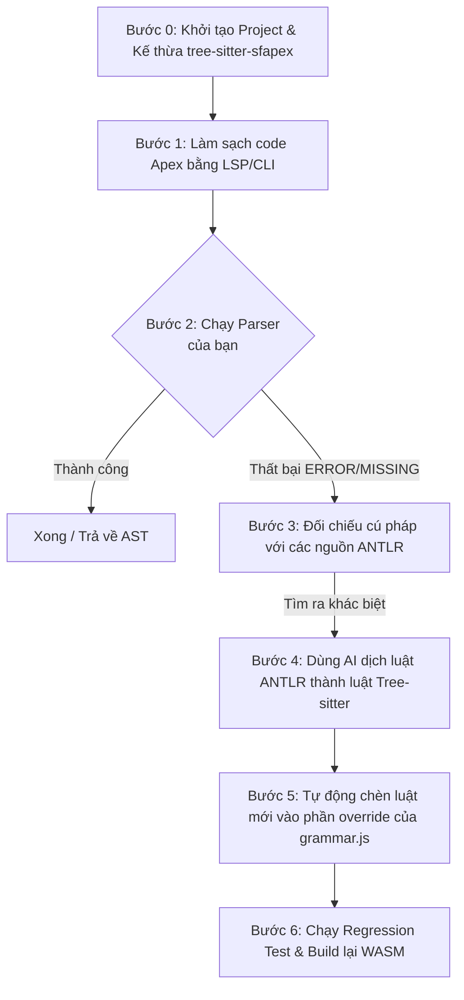

Dưới đây là toàn bộ tài liệu Markdown tổng hợp đầy đủ, chính xác và chi tiết tất cả các bước thành công mà chúng ta đã cùng nhau thực hiện từ đầu đến giờ.

Tài liệu này được thiết kế theo dạng **Step-by-Step Guide** chuẩn chỉnh, giúp bạn dễ dàng lưu trữ (`.md`), đọc lại hoặc chia sẻ cho cộng đồng sau này.

---

# 📘 Tài Liệu Hướng Dẫn: Khởi Tạo Bộ Parser Tree-Sitter Cho Salesforce Apex (Bước 0)

Tài liệu này ghi lại quy trình thiết lập một dự án Parser cho ngôn ngữ **Salesforce Apex** dựa trên việc kế thừa và tối ưu ngữ pháp từ bộ mã nguồn mở `tree-sitter-sfapex`.

## 🏗️ 1. Kiến Trúc Tổng Quan Của Giải Pháp

Để phân tích cú pháp Apex (bao gồm cả các câu lệnh SOQL/SOSL lồng nhau), chúng ta thiết lập một Pipeline tự động hóa với các tầng xử lý như sau:



*Lưu ý về LWC (Lightning Web Components):* Vì LWC bản chất là HTML, CSS, JavaScript chuẩn nên sẽ dùng trực tiếp các parser core có sẵn của Tree-sitter, không gộp chung vào parser Apex để đảm bảo dung lượng nhẹ và tốc độ tối ưu.

---

## 🛠️ 2. Chuẩn Bị Môi Trường (Prerequisites)

Trước khi bắt đầu, máy tính cần cài đặt sẵn:

1. **Node.js** (Khuyến nghị v20 trở lên).
2. **C/C++ Compiler** (`build-essential` trên Linux, `Xcode Command Line Tools` trên macOS, hoặc `Visual Studio Community - Desktop development with C++` trên Windows).
3. **Python 3.x** (để hỗ trợ `node-gyp` biên dịch ngầm).

---

## 🚀 3. Các Bước Thực Hiện Chi Tiết (Đã Thành Công)

### Bước 1: Khởi tạo thư mục và dự án Node.js

Mở Terminal/PowerShell và chạy chuỗi lệnh sau để tạo thư mục và khởi tạo dự án:

```powershell
mkdir salesforce-ast
cd salesforce-ast
npm init -y

```

### Bước 2: Cài đặt các công cụ Tree-sitter và thư viện nguồn

Cài đặt công cụ CLI của Tree-sitter cùng gói wrapper cấu trúc của tác giả làm tài nguyên:

```powershell
npm install tree-sitter-cli nan tree-sitter-sfapex --save-dev

```

### Bước 3: Cấu hình phím tắt trong `package.json`

Mở file `package.json` và cập nhật phần `"scripts"` để tạo các lối tắt vận hành nhanh:

```json
"scripts": {
  "generate": "tree-sitter generate",
  "test": "tree-sitter test"
}

```

### Bước 4: Tải trọn vẹn bộ mã nguồn thô (Grammar thô) từ GitHub

Vì gói cài qua `npm` chỉ chứa các file nhị phân đã compile, chúng ta cần kéo bộ mã nguồn JavaScript định nghĩa các hàm cú pháp thô từ repository gốc của tác giả về để phục vụ cho việc chỉnh sửa/ghi đè (override) sau này:

```powershell
git clone https://github.com/aheber/tree-sitter-sfapex.git sfapex-source

```

### Bước 5: Cấu hình file `grammar.js` (Xương sống của dự án)

Tạo một file tên là `grammar.js` nằm ngay tại thư mục gốc của dự án (`.\salesforce-ast\grammar.js`) và nạp cấu hình kế thừa từ thư mục mã nguồn vừa clone:

```javascript
// Nạp file ngữ pháp Apex gốc từ bộ nguồn đầy đủ cấu trúc
const apexGrammar = require('./sfapex-source/apex/grammar.js');

module.exports = grammar(apexGrammar, {
  name: 'sfapex',

  rules: {
    // VÙNG TRỐNG: Nơi sau này lập trình viên và AI sẽ viết đè (override) luật vào đây
    // Hiện tại để trống để kế thừa 100% từ bộ nguồn gốc của tác giả
  }
});

```

### Bước 6: Khởi tạo cấu hình chuẩn `tree-sitter.json`

Để loại bỏ hoàn toàn các cảnh báo về phiên bản ABI (ABI 14 vs ABI 15) và chuẩn hóa dự án để phân phối, chạy lệnh:

```powershell
npx tree-sitter init

```

*Điền các thông tin cấu hình tương tự như sau:*

* **Parser name:** `apex`
* **File types:** `cls trigger` *(Đây là các đuôi mở rộng của Apex Class và Apex Trigger)*
* **Các thông tin khác (Repository, Author, License):** Điền theo thông tin cá nhân của bạn.
* **Bindings:** Chọn các ngôn ngữ bạn muốn tạo binding (mặc định chọn sẵn Node, Python, C, Rust...). Ấn `Enter` để hoàn thành.

### Bước 7: Biên dịch Parser sang mã nguồn C (`generate`)

Kích hoạt Tree-sitter CLI đọc cấu hình để tự động sinh ra bộ parser bằng ngôn ngữ C:

```powershell
npm run generate

```

*Kết quả thành công:* Terminal chạy im lặng, không báo lỗi và tự động sinh ra thư mục `src/` chứa file `parser.c` bên trong dự án.

---

## 🧪 4. Viết và Chạy Bài Kiểm Tra Đầu Tiên (Testing)

### Bước 1: Tạo file kịch bản Test

Tạo cây thư mục `test/corpus/` và tạo một file test tên là `basic_class.txt` nằm tại đường dẫn: `.\test\corpus\basic_class.txt`.

Chạy lệnh PowerShell dưới đây để tự động tạo file test với định dạng chuẩn của Tree-sitter (chứa code Apex thật và cấu hình cây AST mong đợi):

```powershell
@'
==================
Test Parse Class Apex Don Gian
==================

public class MyHelloWorld {
    public void sayHello() {
        System.debug('Hello World');
    }
}

---

(source_file
  (class_declaration
    (modifiers)
    name: (identifier)
    body: (class_body
      (method_declaration
        (modifiers)
        type: (void_type)
        name: (identifier)
        formal_parameters)
        body: (block
          (expression_statement
            (method_invocation
              object: (identifier)
              name: (identifier)
              arguments: (argument_list (string_literal)))))))))
'@ | Out-File -FilePath .\test\corpus\basic_class.txt -Encoding utf8

```

### Bước 2: Chạy kiểm thử

Kích hoạt lệnh test của hệ thống:

```powershell
npm run test

```

*Kết quả mong đợi:* Hệ thống sẽ quét qua file test, thực hiện parse đoạn code Apex và đối chiếu kết quả với cây AST. Màn hình sẽ hiển thị tích v màu xanh báo hiệu bài test thành công!

---

## 🎯 5. Hướng Đi Tiếp Theo Cho Giai Đoạn 2

Dự án hiện tại đã hoàn tất **Bước 0 (Móng nhà vững chắc)**. Khi bạn đem các file code Apex thực tế ở dự án của bạn vào chạy test:

1. Nếu gặp lỗi `ERROR` hoặc `MISSING` (do Salesforce cập nhật cú pháp mới mà tác giả gốc chưa kịp update).
2. Chúng ta sẽ tra cứu file cấu hình chuẩn mã nguồn mở của chính Salesforce tại repo `forcedotcom/apex-parser` (viết bằng ANTLR4).
3. Sử dụng **AI (LLM)** để dịch luật cú pháp từ file `.g4` của ANTLR sang hàm cấu trúc Tree-sitter và điền vào phần `rules: {}` trong file `grammar.js` để vá lỗi cục bộ.