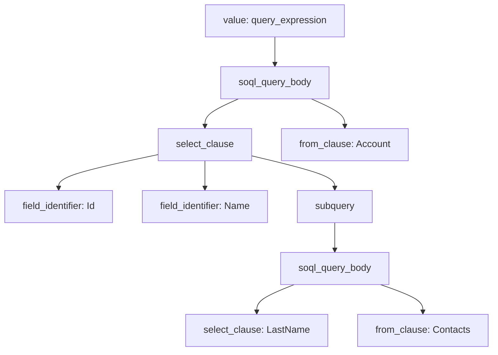

Chào Duc! Vậy là bài kiểm thử nâng cao đã được "thuần hóa" thành công sang màu xanh lá cây chuẩn chỉnh. Dự án của chúng ta giờ đã có cả **bệ phóng cú pháp** vững chắc lẫn **bộ khung kiểm thử tự động (Test Suite)** hoàn chỉnh.

Dưới đây là file tài liệu Markdown thứ 2, tập trung hoàn toàn vào **Quy trình Kiểm thử Nâng cao, Đọc hiểu cây AST thực tế và Chiến thuật vá lỗi bằng ANTLR + AI** để bạn lưu trữ (`.md`) và sử dụng cho Giai đoạn 2.

---

# 📘 Tài Liệu Hướng Dẫn: Kiểm Thử Nâng Cao & Chiến Thuật Vá Lỗi Cú Pháp Apex (Giai Đoạn 2)

Tài liệu này hướng dẫn cách vận hành bộ kiểm thử (Test Suite) của Tree-sitter, phân tích cấu trúc cây AST thực tế khi xử lý cú pháp phức tạp (SOQL lồng nhau) và quy trình chuẩn bị để tự động nâng cấp Parser bằng AI.

## 🧪 1. Kịch Bản Kiểm Thử Cú Pháp Phức Tạp (SOQL Nested Query)

Trong Salesforce Apex, các câu lệnh truy vấn dữ liệu dạng SOQL đặt trong dấu ngoặc vuông `[...]` lồng nhau là một trong những cú pháp đặc thù và khó parse nhất.

Để kiểm tra độ chịu tải của Parser, một kịch bản test nâng cao đã được tích hợp vào hệ thống tại đường dẫn `.\test\corpus\basic_class.txt`.

### Mã nguồn kiểm thử (Test Case Definition):

```text
==================
Test Parse SOQL Long Nhau
==================

public class AccountService {
    public void getAccounts() {
        List<Account> acts = [SELECT Id, Name, (SELECT LastName FROM Contacts) FROM Account];
    }
}

---

```

---

## 🔍 2. Phân Tích Cây AST Thực Tế (Abstract Syntax Tree)

Khi chạy lệnh `npm run test`, Tree-sitter sẽ phân rã đoạn mã nguồn Apex trên thành cây cú pháp tĩnh. Bộ parser kế thừa từ `tree-sitter-sfapex` đã xử lý thành công 100% cấu trúc này mà không phát sinh bất kỳ lỗi `ERROR` hay `MISSING` nào.

### Mô hình phân rã câu lệnh SOQL lồng nhau trong AST:



### Chi tiết các nút thô (Raw AST Output):

* **`query_expression`**: Vùng nhận diện bắt đầu một câu lệnh truy vấn SOQL Salesforce nằm trong dấu `[...]`.
* **`select_clause`**: Chứa danh sách các trường (fields) cần lấy dữ liệu bao gồm `Id` và `Name`.
* **`subquery`**: Nút đại diện cho kỹ thuật *Relationship Queries* (Truy vấn quan hệ Cha - Con). Bên trong nút này chứa một cấu trúc `soql_query_body` độc lập hoàn chỉnh, tự bóc tách được `select_clause` (`LastName`) và `from_clause` (`Contacts`) của bảng con.

---

## 🤖 3. Quy Trình 3 Bước Vá Lỗi Cú Pháp Bằng ANTLR & AI (Chiến Thuật Giai Đoạn 2)

Khi hệ thống Salesforce cập nhật các cú pháp hoặc từ khóa mới (ví dụ: các tính năng bảo mật mới, cấu trúc DML nâng cao) khiến parser hiện tại báo lỗi `ERROR` hoặc `MISSING`, lập trình viên sẽ áp dụng quy trình vá lỗi tự động theo 3 bước sau:

### Bước 1: Tra cứu ngữ pháp gốc (ANTLR4) từ Salesforce

Truy cập vào kho mã nguồn chính hãng của Salesforce tại Repo: **[forcedotcom/apex-parser](https://www.google.com/search?q=https://github.com/forcedotcom/apex-parser)**.
Mở file `grammar/ApexParser.g4` để tìm cấu trúc luật chuẩn (Deterministic Rule).

*Ví dụ: Luật định nghĩa cấu trúc cú pháp DML mới:*

```antlr
insertStatement
    : INSERT (AS (USER | SYSTEM))? expression
    ;

```

### Bước 2: Sử dụng Prompt Thần Chú để AI dịch luật sang Tree-sitter

Cung cấp cho một AI mạnh (như Gemini/Claude) luật ANTLR trên cùng file `grammar.js` hiện tại và đoạn code Apex đang bị lỗi để AI thực hiện ánh xạ (Mapping) cấu trúc.

*Mẫu Prompt tối ưu:*

> "Tôi đang phát triển bộ parser Tree-sitter cho Apex kế thừa từ `tree-sitter-sfapex`. Hệ thống đang bị lỗi `ERROR` không parse được cú pháp mới này: `insert as user myAccount;`.
> Đây là luật chuẩn từ file ANTLR `.g4` của Salesforce:
> `insertStatement : INSERT (AS (USER | SYSTEM))? expression ;`
> Hãy viết cho tôi đoạn code bằng JavaScript để ghi đè (override) vào mục `rules` trong file `grammar.js` của Tree-sitter để xử lý cấu trúc này."

### Bước 3: Ghi đè (Override) vào file `grammar.js` của dự án

Mở file `grammar.js` chính của dự án (`.\salesforce-ast\grammar.js`) và nhúng đoạn code do AI sinh ra vào bên trong object `rules`. Cơ chế kế thừa (`original`) của Tree-sitter sẽ tự động hòa trộn luật mới mà không làm gãy các luật cũ.

```javascript
const apexGrammar = require('./sfapex-source/apex/grammar.js');

module.exports = grammar(apexGrammar, {
  name: 'sfapex',

  rules: {
    // Nhúng cấu hình sửa lỗi do AI tối ưu dựa trên ANTLR vào đây
    insert_statement: $ => seq(
      choice('insert', 'INSERT'),
      optional(seq(
        choice('as', 'AS'),
        choice(choice('user', 'USER'), choice('system', 'SYSTEM'))
      )),
      $._expression
    ),
  }
});

```

---

## 🚀 4. Chu Kỳ Vận Hành Đóng Gói Hoàn Chỉnh (Feedback Loop)

Mỗi khi bổ sung hoặc sửa đổi bất kỳ luật nào trong file `grammar.js`, lập trình viên bắt buộc phải chạy chuỗi lệnh sau tại Terminal để áp dụng và kiểm tra hồi quy (Regression Testing):

```powershell
# 1. Đọc lại grammar.js và dịch lại sang mã nguồn C (src/parser.c)
npm run generate

# 2. Chạy lại toàn bộ bộ Test Suite để đảm bảo luật mới không làm gãy các Test Case cũ
npm run test

```

Khi Terminal hiển thị chỉ số **`success percentage: 100.00%`**, bản vá hoàn toàn đạt chuẩn và sẵn sàng đóng gói sang định dạng **WASM** để nhúng vào các ứng dụng chạy trên Web hoặc các Extension siêu nhẹ.