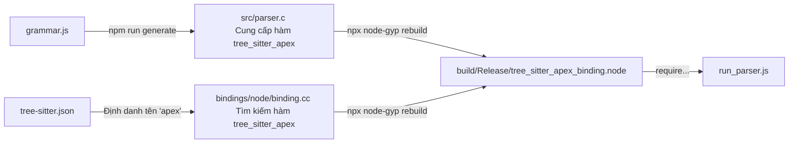

Chào Duc! Bản test thực chiến chạy ra cây AST sạch sẽ chính là cột mốc đánh dấu bạn đã làm chủ hoàn toàn cơ chế kết nối giữa mã nguồn C nhị phân và môi trường runtime Node.js.

Dưới đây là file tài liệu thứ 3, tổng hợp toàn bộ các kỹ thuật giải quyết xung đột Linker (`LNK2001`), lỗi lệch pha phiên bản ABI và cách triển khai Script phân tích cú pháp chủ động để bạn lưu trữ (`.md`).

---

# 📘 Tài Liệu Hướng Dẫn: Đồng Bộ Cấu Trúc Nhị Phân Native & Script Săn Lỗi Cú Pháp (Giai Đoạn 3)

Tài liệu này ghi lại các bước giải quyết xung đột biên dịch C++ trên Windows (MSBuild), đồng bộ hóa kiến trúc ABI giữa Tree-sitter CLI và Node.js, đồng thời hiện thực hóa Script chủ động quét mã nguồn mã hóa AST.

## 🏗️ 1. Sơ Đồ Kiến Trúc Cầu Nối Nhị Phân (Native Binding)

Để Node.js có thể vận hành bộ Parser được viết bằng C/C++, hệ thống phải đi qua một chuỗi biên dịch nghiêm ngặt nhằm tạo ra file Node Addon (`.node`).



---

## 🛠️ 2. Các Lỗi Kinh Điển Trên Windows & Giải Pháp Dứt Điểm

### Lỗi 1: Xung đột Linker `LNK2001: unresolved external symbol`

* **Hiện tượng:** Trình biên dịch MSBuild báo lỗi không thể tạo file `.node` do lệch pha tên gọi giữa file cấu hình và file `grammar.js` (Bên tìm `tree_sitter_apex`, bên cung cấp `tree_sitter_sfapex`).
* **Giải pháp:** Đồng bộ hóa thuộc tính `"name"` trong file `tree-sitter.json` và thuộc tính `name` trong file `grammar.js` về cùng một định danh duy nhất (Khuyến nghị dùng tên chuẩn: `apex`).

### Lỗi 2: Lệch pha ABI `TypeError: Cannot read properties of undefined (reading 'length')`

* **Hiện tượng:** Lệnh biên dịch code C thành công nhưng khi chạy bằng Node.js thì bị sập tại hàm `setLanguage`. Nguyên nhân do `tree-sitter-cli` (bản phát sinh code C) và gói `tree-sitter` (bản Node.js runtime) không cùng phiên bản ABI.
* **Giải pháp:** Ép cập nhật thư viện Node.js lên bản mới nhất để tương thích với cấu trúc biên dịch ABI mới của CLI:
```powershell
npm install tree-sitter@latest

```


---

## 💻 3. Triển Khai Kịch Bản Săn Lỗi Cú Pháp Chủ Động (`run_parser.js`)

Tạo file `run_parser.js` nằm tại thư mục gốc của dự án nhằm mục đích nạp mã nguồn Apex thực tế, phân rã thành cây cú pháp và tự động cảnh báo nếu phát hiện các cấu trúc bị gãy (`ERROR`).

### Mã nguồn Script hoàn chỉnh (Cập nhật chuẩn ABI mới):

```javascript
const Parser = require('tree-sitter');
// 1. Nạp file nhị phân C++ đã compile thành công theo đúng tên target trong file binding.gyp
const SfApex = require('./build/Release/tree_sitter_apex_binding.node'); 

const parser = new Parser();
parser.setLanguage(SfApex);

// 2. Đoạn mã nguồn Apex đưa vào phân tích thực chiến
const sourceCode = `
public class UserService {
    public void createUsers() {
        // Bạn có thể cố tình viết sai cú pháp tại đây để thử nghiệm tính năng bắt lỗi của Bot
        insert_special_mode myAccount; 
    }
}
`;

// 3. Tiến hành phân rã mã nguồn sang cây AST tĩnh
const tree = parser.parse(sourceCode);

// 4. Hàm đệ quy duyệt cây (Tree Traversal) để săn lùng nút 'ERROR' hoặc nút bị thiếu (Missing)
function findErrors(node) {
    // Lưu ý: Ở phiên bản tree-sitter mới, node.isMissing là thuộc tính (property Getter), không phải là hàm
    if (node.type === 'ERROR' || node.isMissing) {
        console.log(`\n❌ Phát hiện lỗi cú pháp tại dòng ${node.startPosition.row + 1}:`);
        console.log(` > Đoạn code lỗi: "${sourceCode.substring(node.startIndex, node.endIndex)}"`);
        return true;
    }

    // Duyệt sâu qua toàn bộ các nút con (Children Nodes)
    for (let i = 0; i < node.childCount; i++) {
        if (findErrors(node.child(i))) return true;
    }
    return false;
}

console.log("=== 🚀 Bắt đầu quét mã nguồn Apex ===");
const hasError = findErrors(tree.rootNode);

if (!hasError) {
    console.log("✅ Tuyệt vời! Code sạch 100%, không phát sinh lỗi parser.");
    console.log("\n[Cấu trúc cây AST thực tế]:");
    console.log(tree.rootNode.toString());
} else {
    console.log("\n🤖 GỢI Ý PIPELINE VÁ LỖI CỦA AI:");
    console.log(" 1. Hãy copy đoạn code lỗi được chỉ định ở trên.");
    console.log(" 2. Tra cứu luật tương ứng trong `forcedotcom/apex-parser` (ANTLR4).");
    console.log(" 3. Sử dụng Prompt mẫu để AI dịch sang luật Tree-sitter và chèn vào `grammar.js`.");
}

```

---

## 🚀 4. Chu Kỳ Vận Hành Sửa Đổi & Khởi Chạy Thực Tế

Mỗi khi thay đổi mã nguồn kiểm thử hoặc cập nhật luật mới trong `grammar.js`, chuỗi lệnh vận hành chuẩn hóa trên Windows PowerShell bao gồm:

```powershell
# Bước 1: Đồng bộ hóa định danh và sinh lại mã nguồn C chuẩn
npm run generate

# Bước 2: Gọi MSBuild biên dịch lại file cấu trúc nhị phân .node trên Windows
npx node-gyp rebuild

# Bước 3: Khởi chạy script để kiểm tra trạng thái cây AST của mã nguồn
node run_parser.js

```

Khi hệ thống báo **`Code sạch 100%`** kèm theo cấu trúc cây chi tiết như `(class_declaration (body (method_declaration...)))`, bộ Parser của bạn đã đạt trạng thái hoàn hảo, sẵn sàng cung cấp dữ liệu đầu vào (AST) cho các thuật toán phân tích mạng lưới hoặc tính toán nâng cao tiếp theo.