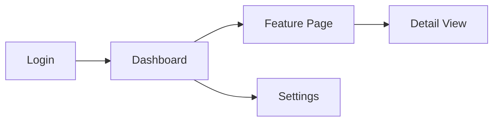

# User Guide (UG)

## {SYSTEM_NAME} — {TICKET_KEY}: {TICKET_SUMMARY}

---

## Document Information

| Field | Value |
|-------|-------|
| Jira Ticket | {TICKET_KEY} |
| Title | {TICKET_SUMMARY} |
| Author | DEV Agent |
| Reviewer | BA Agent |
| Version | 1.0 |
| Date | {CURRENT_DATE} |
| Status | Draft |
| Related BRD | BRD-v{VERSION}-{TICKET-KEY}.docx |
| Related FSD | FSD-v{VERSION}-{TICKET-KEY}.docx |
| Related TDD | TDD-v{VERSION}-{TICKET-KEY}.docx |

---

## Revision History

| Version | Date | Author | Changes |
|---------|------|--------|---------|
| 1.0 | {CURRENT_DATE} | DEV Agent | Initial document |

---

## 1. Introduction

### 1.1 Purpose

{Brief description of what the system does and who this guide is for.}

### 1.2 Audience

| Audience | What They Need |
|----------|---------------|
| {End User / AI Agent} | {How to use the system} |
| {System Administrator} | {How to configure and maintain} |
| {Developer} | {How to extend or integrate} |

### 1.3 Prerequisites

| Prerequisite | Version | Required |
|-------------|---------|----------|
| {Runtime — JDK/Node.js} | {version} | Yes |
| {External service} | {version} | Yes/Optional |

---

## 2. Getting Started

> **IMPORTANT:** This section is for users who **download the release** and run it. Do NOT include "clone repo" or "build from source" instructions here — those belong in a Developer Guide.

### 2.1 Quick Start

```bash
# Step 1: Download the release
{Download command or URL}

# Step 2: Configure
{Create/edit config file}

# Step 3: Run
{Run command}

# Step 4: Verify
{Verification command or expected log output}
```

### 2.2 System Requirements

| Component | Minimum | Recommended |
|-----------|---------|-------------|
| {Runtime} | {version} | {version} |
| {Memory} | {spec} | {spec} |
| {Disk} | {spec} | {spec} |
| {OS} | {spec} | {spec} |

### 2.3 Distribution Formats

| Format | How to Get | Use Case |
|--------|-----------|----------|
| {Fat JAR / Docker / Binary} | {Download URL or command} | {When to use} |

### 2.4 Configuration Methods

{List all ways to configure the system (config file, env vars, CLI args, etc.) with priority/override order.}

| Method | Priority | Best For |
|--------|----------|----------|
| {Config file} | {priority} | {use case} |
| {Environment variables} | {priority} | {use case} |

{Include a minimal working example for each method.}

### 2.5 Verify Configuration

{Step-by-step verification that the system is running correctly:}
- Check 1: {Server started — expected log output}
- Check 2: {Dependencies connected — expected log output}
- Check 3: {Basic functionality test — command + expected result}
- Common issues table: symptom → cause → fix

---

## 3. Configuration

### 3.1 Configuration File

{Path to config file relative to the application (NOT source code path). Describe format (YAML/JSON/TOML) and how to override with environment variables.}

### 3.2 Configuration Reference

#### {Section 1 — e.g., Server Settings}

| Property | Type | Default | Description |
|----------|------|---------|-------------|
| {property.name} | {type} | {default} | {description} |

#### {Section 2 — e.g., Feature Settings}

| Property | Type | Default | Description |
|----------|------|---------|-------------|
| {property.name} | {type} | {default} | {description} |

### 3.3 Environment Variables

| Variable | Description | Required | Example |
|----------|-------------|----------|---------|
| {VAR_NAME} | {description} | {Yes/No} | {example value} |

### 3.4 Configuration Examples

#### Minimal Configuration

```yaml
# {Minimal working config}
```

#### Full Configuration

```yaml
# {Complete config with all options}
```

---

## 4. Usage

### 4.1 {Primary Use Case — e.g., Tool Discovery}

**Description:** {What this feature does.}

**How to use:**

```
{Command or API call example}
```

**Parameters:**

| Parameter | Type | Required | Description |
|-----------|------|----------|-------------|
| {param} | {type} | {Yes/No} | {description} |

**Example:**

```
{Concrete example with real values}
```

**Expected Output:**

```json
{Example response}
```

### 4.2 {Secondary Use Case — e.g., Tool Execution}

{Same structure as 4.1}

### 4.3 {Additional Use Cases}

{Repeat for each major feature}

---

## 5. User Interface Guide (if applicable)

> **Note:** Include this section only if the system has a web UI, desktop UI, or mobile UI. For server-only / CLI-only systems, remove this section entirely.

### 5.1 Screen Overview

| # | Screen | URL / Path | Purpose |
|---|--------|-----------|---------|
| 1 | {Dashboard} | {/dashboard} | {Main overview screen} |
| 2 | {Settings} | {/settings} | {Configuration management} |

### 5.2 {Screen 1 — e.g., Dashboard}


**Key Elements:**

| # | Element | Type | Description |
|---|---------|------|-------------|
| 1 | {Element name} | {Button/Input/Table/Card} | {What it does} |
| 2 | {Element name} | {Type} | {Description} |

**User Actions:**

| Action | Steps | Expected Result |
|--------|-------|-----------------|
| {Action name} | 1. {Step} 2. {Step} | {What happens} |

### 5.3 {Screen 2 — e.g., Settings}

{Same structure as 5.2 — screenshot + elements table + actions table}

### 5.4 Navigation Flow



---

## 6. Administration

### 6.1 {Admin Task 1 — e.g., Adding a New Server}

**Steps:**

1. {Step 1}
2. {Step 2}
3. {Verify}

### 6.2 {Admin Task 2 — e.g., Monitoring Health}

{Steps and commands}

### 6.3 {Admin Task 3 — e.g., Hot-Reload Configuration}

{Steps and commands}

---

## 7. Troubleshooting

### 7.1 Common Issues

| # | Symptom | Cause | Solution |
|---|---------|-------|----------|
| 1 | {Error message or behavior} | {Root cause} | {How to fix} |
| 2 | {Error message or behavior} | {Root cause} | {How to fix} |

### 7.2 Error Codes

| Code | Message | Description | Action |
|------|---------|-------------|--------|
| {ERROR_CODE} | {message} | {what happened} | {what to do} |

### 7.3 Logs

| Log Location | Content | Useful For |
|-------------|---------|------------|
| {path/stdout} | {what's logged} | {debugging scenario} |

### 7.4 FAQ

**Q: {Common question}**
A: {Answer}

---

## 8. API Reference (if applicable)

### 8.1 {API/Tool 1}

| Attribute | Value |
|-----------|-------|
| Name | {name} |
| Description | {description} |

**Input Schema:**

```json
{JSON Schema}
```

**Example Request:**

```json
{Example}
```

**Example Response:**

```json
{Example}
```

### 8.2 {API/Tool 2}

{Same structure}

---

## 9. Appendix

### 9.1 Glossary

| Term | Definition |
|------|------------|
| {term} | {definition} |

### 9.2 Related Documents

| Document | Location |
|----------|----------|
| BRD | BRD-v{VERSION}-{TICKET-KEY}.docx |
| FSD | FSD-v{VERSION}-{TICKET-KEY}.docx |
| TDD | TDD-v{VERSION}-{TICKET-KEY}.docx |
| DPG | DPG-v{VERSION}-{TICKET-KEY}.docx |

### 9.3 Version Compatibility

| System Version | Config Version | Breaking Changes |
|---------------|---------------|-----------------|
| {1.0.0} | {v1} | {Initial release} |
